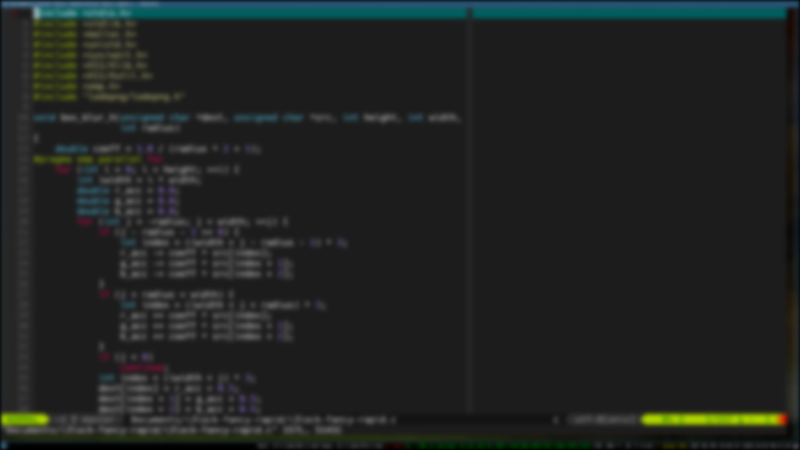

# i3lock-fancy-rapid

A faster implementation of [i3lock-fancy](https://github.com/meskarune/i3lock-fancy). It is blazing fast and provides a fully configurable box blur. It uses linear-time box blur and accelerates using OpenMP.

## Demo



## Build

Make sure you have installed the following dependencies and run
```bash
git clone --recursive https://github.com/yvbbrjdr/i3lock-fancy-rapid
cd i3lock-fancy-rapid
make
```

## Usage

```bash
i3lock-fancy-rapid radius times [OPTIONS]
```

- `radius` is the kernel radius of box blur
- `times` is the number of times box blur is applied
- `OPTIONS` will be passed to `i3lock`

The above demo uses `i3lock-fancy-rapid 5 3`.

## Dependencies

- [libX11](https://www.x.org/releases/current/doc/libX11/libX11/libX11.html) for screenshot
- [OpenMP](https://www.openmp.org/) for multithreading

## License

[BSD 3-Clause](LICENSE)
